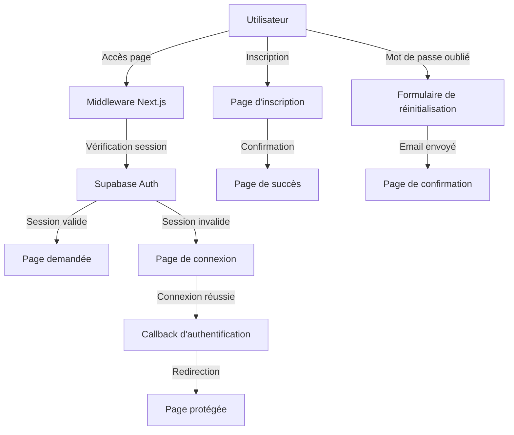

## Plan de structure de l'application

Ce document décrit l'arborescence du projet, le rôle de chaque dossier et de chaque fichier principal. Les artefacts générés automatiquement (ex: `coverage/` et son contenu) ne font pas partie du code applicatif et sont décrits de façon synthétique.

### Racine du projet

- `AGENTS.md` : Documentation sur les agents et leurs comportements attendus.
- `CLAUDE.md` : Documentation spécifique à l'agent Claude et consignes associées.
- `components.json` : Registre des composants (p.ex. shadcn/ui) et configuration de génération.
- `coverage/` : Rapport de couverture de tests (généré par l'outillage). Contient `lcov.info`, `clover.xml` et un site statique `lcov-report/` pour naviguer dans la couverture.
  - `lcov-report/` : Site HTML du rapport de couverture (fichiers CSS/JS/PNG/HTML). Inclut des sous-dossiers reflétant la structure du code source.
- `DOCUMENTATION/` : Documentation du projet.
  - `STRUCTURE.md` : Ce fichier décrivant l'architecture du projet.
- `.eslintrc.json` : Configuration ESLint alternative (format JSON).
- `eslint.config.mjs` : Configuration ESLint principale du projet (format ESM).
- `IMPACT_BADGES_IMPLEMENTATION.md` : Notes de conception et implémentation des badges d'impact.
- `next-env.d.ts` : Types générés par Next.js pour TypeScript.
- `next.config.ts` : Configuration Next.js (build, runtime, images, etc.).
- `package.json` : Dépendances NPM, scripts et métadonnées du projet.
- `package-lock.json` : Verrouillage des versions des dépendances NPM.
- `postcss.config.mjs` : Configuration PostCSS (traitement CSS).
- `public/` : Actifs statiques servis tels quels par Next.js.
  - `evotha-long.png` : Logo principal de l'application.
  - `short-evotha.png` : Version courte du logo.
  - `file.svg`, `globe.svg`, `next.svg`, `vercel.svg`, `window.svg` : Icônes/SVG utilisés par l'UI.
  - `homepage/` : Actifs d'illustration pour la page d'accueil.
    - `chatgpt-logo.png`, `claude-logo.png`, `copilot-logo.png`, `deepseek-logo.png`, `gemini-logo.png`, `perplexity-logo.png` : Logos des moteurs IA.
    - `data-analysis.jpg`, `example-analysis.jpg`, `statistics-down-google-ranking.jpg` : Illustrations d'analyse.
- `README.md` : Guide principal du projet.
- `test.pdf` : Exemple de PDF exporté/test.
- `tsconfig.json` : Configuration TypeScript.
- `tsconfig.tsbuildinfo` : Fichier cache de compilation TypeScript (généré).
- `.superdesign/` : Configuration et ressources du système de design.
- `.windsurfrules` : Règles et configurations du projet.
- `.cursor/` : Configuration spécifique à l'éditeur Cursor.

### `src/` — Code source applicatif

- `app/` : Dossiers et fichiers Next.js App Router (pages, routes API, mise en page, styles globaux).
  - `api/` : Routes API côté serveur.
    - `collect-data/route.ts` : Endpoint pour collecter des données d'analyse.
    - `export-pdf/route.ts` : Endpoint pour générer/renvoyer des exports PDF.
    - `health/route.ts` : Endpoint de santé (root) pour monitoring.
    - `health/ping/route.ts` : Ping simple de vitalité du service.
  - `auth/` : Gestion de l'authentification.
    - `callback/` : Gestion du retour d'authentification.
      - `CallbackRunner.tsx` : Composant d'exécution/traitement post-auth.
      - `page.tsx` : Page Next.js de callback d'authentification.
    - `confirm/` : Confirmation d'authentification.
    - `error/` : Gestion des erreurs d'authentification.
    - `forgot-password/` : Réinitialisation de mot de passe.
    - `login/` : Connexion utilisateur.
    - `sign-up/` : Inscription utilisateur.
    - `sign-up-success/` : Confirmation d'inscription réussie.
    - `update-password/` : Mise à jour de mot de passe.
  - `protected/` : Pages nécessitant une authentification.
    - `page.tsx` : Page protégée d'exemple.
  - `report/` : Pages de rapport d'analyse.
    - `page.tsx` : Page principale du rapport.
  - `favicon.ico` : Icône du site.
  - `fonts/DM_Sans/` : Polices locales.
    - `DMSans-Regular.ttf`, `DMSans-SemiBold.ttf` : Variantes de police utilisées.
  - `globals.css` : Styles globaux/tokens de design.
  - `layout.tsx` : Layout racine (providers, métadonnées, structure globale).
  - `page.tsx` : Page d'accueil.
  - `middleware.ts` : Middleware Next.js pour l'authentification et la protection des routes.

- `components/` : Composants d'interface (UI, sections, layouts, formulaires, etc.).
  - `auth/` : Composants d'authentification.
    - `SignInModal.tsx` : Modale d'authentification/connexion.
  - `call-to-action.tsx` : Section/Appel à l'action.
  - `content-4.tsx` : Bloc de contenu (section marketing/présentation).
  - `customized/` : Variantes custom de composants.
    - `collapsible/collapsible-04.tsx` : Variante spécifique de composant repliable.
    - `progress/CircularScore.tsx` : Affichage circulaire d'un score.
    - `progress/progress-10.tsx` : Barre/progression personnalisée.
  - `features-1.tsx`, `features-5.tsx` : Sections de fonctionnalités (landing/homepage).
  - `footer.tsx` : Pied de page global.
  - `forms/` : Composants de formulaires.
    - `index.ts` : Barrel export des formulaires.
    - `UrlForm.tsx` : Formulaire de saisie d'URL à analyser.
  - `header.tsx` : En-tête global (version serveur).
  - `header.client.tsx` : En-tête global (version client) avec gestion d'état d'authentification et navigation responsive.
  - `header-with-user-nav.tsx` : Composant d'en-tête avec navigation utilisateur intégrée.
  - `hero-section.tsx` : Section héro de la page d'accueil.
  - `index.ts` : Barrel export des composants de `components/`.
  - `layouts/` : Layouts spécialisés.
    - `index.ts` : Barrel export des layouts.
    - `ReportLayout.tsx` : Layout dédié aux pages de rapport.
  - `logo-cloud.tsx` : Nuage/logos partenaires.
  - `logo.tsx` : Composant logo.
  - `motion-primitives/` : Composants d'animation.
    - `infinite-slider.tsx` : Slider infini (animation).
    - `progressive-blur.tsx` : Effet de flou progressif.
  - `sign-up.tsx` : Section d'inscription/cta email.
  - `login.tsx` : Composant de connexion.
  - `logout-button.tsx` : Bouton de déconnexion.
  - `forgot-password-form.tsx` : Formulaire de réinitialisation de mot de passe.
  - `update-password-form.tsx` : Formulaire de mise à jour de mot de passe.
  - `user-nav.tsx` : Navigation utilisateur avec gestion des états d'authentification.
  - `ui/` : Bibliothèque de composants UI réutilisables.
    - `AEOScoreDisplay.tsx` : Widget d'affichage du score AEO.
    - `AIEngineLogos.tsx` : Affichage des logos des moteurs IA.
    - `analysis/` : Sous-composants spécialisés pour l'affichage d'analyse.
      - `ImpactBadge.tsx` : Badge d'impact d'un critère.
      - `ImpactBadgeDemo.tsx` : Démo/aperçu des badges d'impact.
      - `index.ts` : Barrel export de la sous-lib d'analyse.
      - `MainSectionAnalysis.tsx` : Affichage d'une section d'analyse principale.
      - `MetricCard.tsx` : Carte de métrique/score détaillé.
      - `StatusIcon.tsx` : Icône d'état (succès/avertissement/erreur).
      - `SubSectionAnalysis.tsx` : Affichage d'une sous-section d'analyse.
    - `AnalysisLogs.tsx` : Journalisation visible de la progression/analyse.
    - `AnalysisPlaceholder.tsx` : Placeholder en attente d'analyse.
    - `AnalysisProgress.tsx` : Indicateur de progression d'analyse.
    - `animated-group.tsx` : Utilitaires d'animations groupées.
    - `BackButton.tsx` : Bouton retour/navigation.
    - `badge.tsx` : Badge UI générique.
    - `button.tsx` : Bouton UI générique.
    - `card.tsx` : Carte UI générique.
    - `collapsible.tsx` : Composant repliable générique.
    - `CollectionResults.tsx` : Liste/résumé des résultats collectés.
    - `dropdown-menu.tsx` : Menu déroulant avec support des composants enfants.
    - `avatar.tsx` : Composant d'avatar utilisateur.
    - `ErrorMessage.tsx` : Affichage d'erreurs pour l'utilisateur.
    - `ExampleLink.tsx` : Lien d'exemple (pré-rempli) vers une analyse.
    - `FeatureBadges.tsx` : Ensemble de badges de fonctionnalités.
    - `Footer.tsx` : Pied de page (variante UI).
    - `Header.tsx` : En-tête (variante UI).
    - `HeroSection.tsx` : Section héro (variante UI).
    - `index.ts` : Barrel export de la lib `ui`.
    - `input.tsx` : Champ de saisie.
    - `label.tsx` : Étiquette de formulaire.
    - `LoadingSpinner.tsx` : Indicateur de chargement.
    - `text-effect.tsx` : Effets de texte/stylisation.

- `hooks/` : Hooks React personnalisés.
  - `useAnalysis.ts` : Hook principal pour orchestrer le cycle d'analyse (états, effets, appels services).

- `lib/` : Utilitaires applicatifs et configuration de services.
  - `constants.ts` : Constantes globales.
  - `impact-weights.ts` : Pondérations des critères pour le calcul de score AEO.
  - `supabase/` : Configuration et clients Supabase.
    - `client.ts` : Client Supabase côté client.
    - `server.ts` : Client Supabase côté serveur.
    - `middleware.ts` : Middleware Supabase pour l'authentification.
  - `utils.ts` : Fonctions utilitaires génériques.

- `services/` : Moteur d'analyse (domaine) et logique de calcul.
  - `accessibility-analyzer/` : Analyses liées à l'accessibilité.
    - `content-accessibility-analysis.ts` : Analyse du contenu pour l'accessibilité.
    - `index.ts` : Point d'entrée/export du module d'accessibilité.
    - `navigational-accessibility-analysis.ts` : Analyse de la navigation et structure.
    - `shared/`
      - `constants.ts` : Constantes spécifiques à l'accessibilité.
      - `types.ts` : Types/models pour ce domaine.
      - `utils.ts` : Fonctions utilitaires communes.
    - `technical-accessibility-performance-analysis.ts` : Analyse technique/perf liée à l'accessibilité.
  - `aeo-score-calculator.ts` : Calculateur de score AEO global (agrégation/pondération).
  - `crawler.ts` : Collecte des données (récupération de contenu/page).
  - `discoverability-analyzer/` : Analyses liées à la découvrabilité (robots/IA/etc.).
    - `ai-access-analysis.ts` : Vérification de l'accès des moteurs IA.
    - `index.ts` : Point d'entrée/export du module.
    - `llm-txt-analysis.ts` : Analyse d'un `llm.txt`.
    - `llms-txt-analysis.ts` : Analyse de `llms.txt`.
    - `shared/`
      - `constants.ts` : Constantes pour la découvrabilité.
      - `types.ts` : Types/models.
      - `utils.ts` : Utilitaires communs.
    - `technical-foundation-analysis.ts` : Fondations techniques (robots.txt, sitemaps, etc.).
  - `index.ts` : Point d'entrée/export des services d'analyse.
  - `llm-formatting-analyzer/` : Analyses de mise en forme orientées LLM.
    - `content-hierarchy-analysis.ts` : Hiérarchie et titres.
    - `index.ts` : Point d'entrée/export du module.
    - `inline-semantics-analysis.ts` : Sémantique inline (strong/em/code...).
    - `layout-structural-roles-analysis.ts` : Rôles/structure HTML (landmarks ARIA/HTML5).
    - `shared/`
      - `constants.ts` : Constantes spécifiques au formatage LLM.
      - `types.ts` : Types/models.
      - `utils.ts` : Utilitaires communs.
  - `performance-config.ts` : Paramètres/perf pour orchestrer les analyses.
  - `readability-analyzer/` : Analyses de lisibilité du contenu.
    - `content-organization-analysis.ts` : Organisation du contenu.
    - `index.ts` : Point d'entrée/export.
    - `linguistic-precision-analysis.ts` : Précision linguistique.
    - `shared/`
      - `constants.ts` : Constantes spécifiques lisibilité.
      - `types.ts` : Types/models.
      - `utils.ts` : Utilitaires communs.
    - `text-clarity-analysis.ts` : Clarté du texte.
  - `shared/`
    - `index.ts` : Exports partagés inter-domaines.
    - `semantic-html5-analyzer.ts` : Analyse sémantique HTML5 générique.
  - `structured-data-analyzer/` : Analyses de données structurées.
    - `index.ts` : Point d'entrée/export du module.
    - `json-ld-analysis.ts` : Analyse JSON-LD.
    - `meta-tags-analysis.ts` : Analyse des meta tags.
    - `shared/`
      - `constants.js`, `constants.ts` : Constantes (JS/TS).
      - `types.js`, `types.ts` : Types/models (JS/TS).
      - `utils.js`, `utils.ts` : Utilitaires (JS/TS).
    - `social-meta-analysis.ts` : Analyse des métadonnées sociales (Open Graph/Twitter...).

- `transformers/` : Transformations des résultats d'analyse vers des structures prêtes pour l'UI/rapport.
  - `accessibility-transformer.ts` : Mapping et normalisation des résultats d'accessibilité.
  - `discoverability-transformer.ts` : Mapping des résultats de découvrabilité.
  - `index.ts` : Point d'entrée/export des transformateurs.
  - `llm-formatting-transformer.ts` : Transformations pour analyses de formatage LLM.
  - `readability-transformer.ts` : Transformations pour lisibilité.
  - `structured-data-transformer.ts` : Transformations pour données structurées.

- `types/` : Définitions de types TypeScript.
  - `analysis-architecture.ts` : Types/contracts transverses décrivant l'architecture d'analyse et ses entités.

- `utils/` : Utilitaires transverses (non liés à un domaine d'analyse particulier).
  - `analytics.ts` : Télémetrie/analytics (événements, mesures d'usage).
  - `index.ts` : Barrel export des utilitaires.
  - `logger.ts` : Journalisation centralisée.
  - `url.ts` : Helpers de manipulation d'URL.
  - `urlGuards.ts` : Gardiens/validation d'URL.

---

## Changements majeurs depuis la dernière version

### Architecture d'en-tête renouvelée
- **Header client/serveur séparé** : `header.client.tsx` pour la gestion d'état côté client avec authentification en temps réel
- **Header serveur** : `header.tsx` pour le rendu initial côté serveur
- **Navigation utilisateur** : `user-nav.tsx` pour la gestion des états d'authentification
- **Intégration Supabase** : Synchronisation automatique des états d'authentification entre client et serveur

### Composants d'authentification complets
- **Système d'authentification complet** : Ajout de composants pour la gestion des comptes utilisateurs
- **Formulaires spécialisés** : `login-form.tsx`, `sign-up-form.tsx`, `forgot-password-form.tsx`, `update-password-form.tsx`
- **Pages d'authentification** : Routes complètes dans `app/auth/` pour la gestion du cycle de vie des comptes
- **Protection des routes** : Middleware d'authentification et pages protégées

### Composants UI enrichis
- **Menu déroulant avancé** : `dropdown-menu.tsx` avec support des composants enfants et alignement
- **Avatar utilisateur** : `avatar.tsx` pour l'affichage des profils avec fallback automatique
- **Composants d'analyse** : Structure complète dans `ui/analysis/` avec badges d'impact et métriques
- **Collection de résultats** : `CollectionResults.tsx` pour l'affichage des données collectées

### Configuration Supabase
- **Architecture multi-environnement** : Séparation client/serveur/middleware dans `lib/supabase/`
- **Authentification robuste** : Intégration complète avec Supabase Auth et synchronisation des états

### Middleware et sécurité
- **Protection des routes** : Middleware Next.js pour l'authentification
- **Validation des accès** : Système de gardiens pour les pages protégées

Remarques:
- Les sous-dossiers `shared/` dans les analyseurs regroupent constantes, types et utilitaires spécifiques à chaque domaine.
- Les fichiers `index.ts` servent majoritairement de points d'entrée (barrel exports) pour simplifier les imports.
- Les ressources de `coverage/` et son `lcov-report/` sont générées automatiquement par l'outillage de tests et ne nécessitent pas de maintenance manuelle.
- Le système d'authentification est maintenant intégré de manière native avec protection des routes et gestion des sessions.
- L'architecture d'en-tête sépare clairement les responsabilités client/serveur pour une meilleure performance et SEO.

### Scripts NPM

Depuis `package.json`:

- `dev` : Lance le serveur de développement Next.js avec Turbopack pour des builds rapides.
- `build` : Compile l'application pour la production (`next build`).
- `start` : Démarre le serveur Next.js en mode production sur le build pré-compilé.
- `lint` : Exécute ESLint via la configuration Next.js.
- `type-check` : Vérifie les types TypeScript sans émettre de sortie (`tsc --noEmit`).
- `preview` : Effectue un build puis lance `next start` pour une pré-visualisation locale de la prod.

### Diagramme d'architecture des flux d'analyse

Le diagramme ci-dessous illustre le parcours complet d'une analyse depuis l'UI jusqu'au calcul du score et l'export PDF.

```mermaid
graph TD
  U[Utilisateur] -->|Saisie URL| UI[Hook useAnalysis]
  UI -->|POST /api/collect-data| API[Route API collect-data]
  API -->|validateAndNormalizeUrl| VAL[Validation URL]

  subgraph Collecte en parallèle
    API --> H[fetchStaticHTML]
    API --> R[fetchRobotsTxt]
    API --> S[fetchSitemap]
    API --> L[fetchLlmsTxt]
  end

  H --> M[extractBasicMetadata]

  subgraph Analyses
    API --> D[analyzeDiscoverability]
    API --> SD[analyzeStructuredData]
    API --> LLM[analyzeLLMFormatting]
    API --> ACC[analyzeAccessibility]
    API --> READ[analyzeReadability]
  end

  D --> DT[DiscoverabilityTransformer]
  SD --> SDT[StructuredDataTransformer]
  LLM --> LLMT[LLMFormattingTransformer]
  ACC --> AT[AccessibilityTransformer]
  READ --> RT[ReadabilityTransformer]

  DT --> RES[AnalysisResults (UI-ready)]
  SDT --> RES
  LLMT --> RES
  AT --> RES
  RT --> RES

  RES --> SCORE[AEOScoreCalculator]
  SCORE --> API
  API --> UI

  UI -->|Optionnel: POST /api/export-pdf| PDF[Route API export-pdf]
  PDF --> CHR[Puppeteer / Chromium]
  CHR --> FILE[PDF téléchargeable]
```

### Nouveau flux d'authentification



### Architecture d'en-tête client/serveur

```mermaid
graph TD
  subgraph "Rendu initial (SSR)"
    LAYOUT[Layout racine] --> HEADER_SERVER[header.tsx]
    HEADER_SERVER --> USER_EMAIL[Email utilisateur initial]
  end
  
  subgraph "Hydratation client"
    HEADER_CLIENT[header.client.tsx] --> AUTH_STATE[État authentification]
    AUTH_STATE --> SUPABASE[Client Supabase]
    SUPABASE --> AUTH_CHANGE[onAuthStateChange]
    AUTH_CHANGE --> ROUTER_REFRESH[router.refresh()]
  end
  
  subgraph "Navigation utilisateur"
    USER_NAV[user-nav.tsx] --> DROPDOWN[Dropdown menu]
    DROPDOWN --> LOGOUT[LogoutButton]
    DROPDOWN --> SUPPORT[Contact support]
  end
  
  AUTH_STATE --> USER_NAV
  ROUTER_REFRESH --> HEADER_SERVER
```


